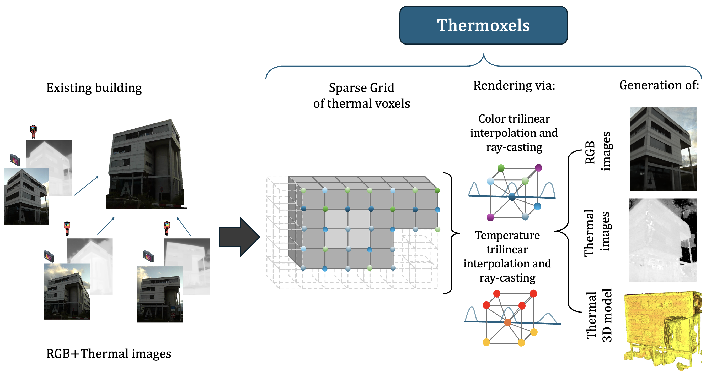

# Thermoxels: Learn multimodal 3D models with Thermal Voxels

This paper was accepted as an oral presentation at CISBAT 2025.

[PDF](https://arxiv.org/abs/2504.04448), [Cite us](thermoxels.bib)

## Introduction



This is the repo of Thermoxels, a multimodal 3D reconstruction method that learns a 3D representation of a scene from RGB and thermal images.
Thermoxels a voxel-based representation of the scene, where each voxel
is associated with a density, a temperature and a color.
It is build upon [Plenoxels](https://github.com/sxyu/svox2)

In our inclusion of temperature, we learn a view indepenent temeprature on the
foreground object being compare with ground truth thermal images.
This appproach tends to remove reflections of thermal images and improve can be
performed with few thermal images compare to RGB ones.

## Dataset

We complete [ThermoScenes](https://zenodo.org/records/15609062),
with three new scenes including reflections. On one of them called shiny tablet, we
removed reflections on the eval set to evaluate model's ability to effectively
suppress reflections.

## Installation

Thermoxels is built upon Plenoxels and need the following version of cuda and python
packages to be compiled:
PyTorch `1.11.0+cu113` and torchvision `0.12.0+cu113` are required to run the code.
See PyTorch installation instructions [here](https://pytorch.org/get-started/previous-versions/) to find the correct version.
It has been developed and tested on python 3.10.

To install Thermoxels on a tested environment, you can use our provided Dockerfile
in the dockerfile folder.

## Prepare dataset

To prepare nerfstudio-format dataset, you can use the following script:

```bash
python hot_cubes/dataset/colmap_json_to_txt.py --folder {your_path}
```

This will add a pose folder with pose matrices at ".txt" format. Further
implementation of the ThermoScene class could rely on only on the .json format.

## Train and Evaluate

### Azure

Train on azure with `/scripts/azure/train_thermoxel.py --training-param.scene-name {scene_name}`.

### Local

To train and evaluate Thermoxels, first download our dataset and then use the following
scripts

```bash
python hot_cubes/cli/train_thermoxel_model.py --data_dir
{data_dir} --train_dir {train_dir} --n_epoch  {n_epoch} --scene-radius {radius}
```

All the training params are in the `hot_cubes/model/training_aparam.py` and can be
modified with the CLI arguments.
Adding `CUDA_LAUNCH_BLOCKING=1` before python launch can sometimes mitigate some cuda
issues.

E.g.

```bash
CUDA_LAUNCH_BLOCKING=1 python hot_cubes/cli/train_thermoxel_model.py --data_dir dataset/dataset_name --train_dir training/ --n_epoch  10 --scene-radius 10
```

This will save the model as `ckpt.npz` and the rendered images in the training folder.

## Mesh export

You can export a mesh from the trained model using the following script:

```bash
python hot_cubes/grid_export/grid_to_stl.py --npz-file ckpt.npz --put-colors --percentile-threshold 90
```

This will save the mesh in obj format in the same folder as the npz file. Color is
derived from the temperature of the voxels using a colormap and the percentile
threshold is used to keep only the volxels with a density above threshold.
Filtering of the mesh is natively done, keeping only the largest connected component
of the mesh. If your foreground object vanishes when exporting, turn this option off
and perform post filtering of the mesh, for instance with [Meshlab](https://www.meshlab.net/).

## Generate gif of mesh


You can generate gifs of already generated meshes using :

```bash
export XDG_SESSION_TYPE=x11
python hot_cubes/grid_export/generate_gif_of_mesh.py --obj-file-path {your_path.obj}
--total-frames {n_frames}
```

The export is needed because libdecor-gtk needs X11 still.

This will generate a gif of the mesh rotating around the x axis.
If needed, you can provide an initial rotation angle prior to the x-axis rotation.

## Contribute

We welcome contributions to Thermoxels. Please look at existing issues on the code.

We format code using ruff and follow PEP8.
The code needs to be type annotated and following our documentation style.
